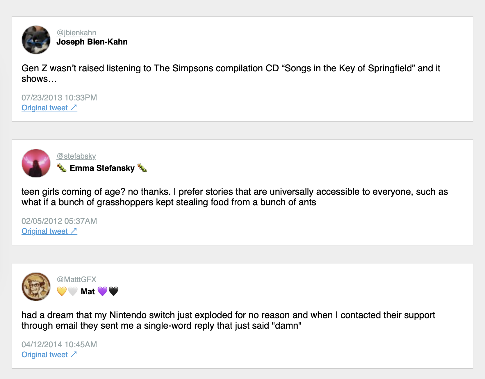

# Twitter Likes Exporter

Hacky Python scripts for downloading your Twitter likes and converting to HTML. Includes support for downloading user avatars and image media in tweets. Scrapes tweets using the GraphQL API powering Twitter.com - the equivalent of you scrolling through all your likes in your web browser, only saved locally forever!



Note only currently supports grabbing the liked tweet. So if it was a quote tweet, does not download the RT'd tweet. If it's a reply or part of a thread, does not download the other tweets.

Meant to jumpstart you to at least getting your tweets offline from Twitter, if not building something much better!

## Setup

Intended for use with Python 3.7. First install requirements:

```bash
pip install -r requirements.txt
```

(It's just `requests`). Next you'll need to populate the `config.json` file (create it by copying `config_template.json`) with credentials needed to match how your web browser gets your likes from Twitter.com:

1. Open up your web browser and ensure the Network web debugging tab is open so you can inspect network requests (in Chrome, it is under `Open Chrome Developer Console` `>` `Network`)
2. Navigate to `https://twitter.com/<your_user_handle>/likes`
3. Look for a network request to an `api.twitter.com` domain path ending in `/Likes` (you can type `/likes` in the filter box at the top left of the debug console). You need to find `userId`, `authorization`, `cookie` and `x-csrf-token` values from the network request and fill the corresponding fields in `config.json`.
4. From the request headers, copy paste the following details (you can right click on the request and select `Copy` `>` `Copy as cURL` and paste into an editor window for the ease of finding these details):
    a. Copy the `Authorization` value (find it as `authorization: Bearer xxx`) and save as `HEADER_AUTHORIZATION` in `config.json`
    b. Copy the `Cookies` value (find it as `cookie: xxx`) and save as `HEADER_COOKIES` in `config.json`. Note that while pasting cookie value, you would need to escape any existing double quotes by prefixing them with a backslash (`\`).
    c. Copy the `x-csrf-token` (find it as `x-csrf-token: xxx`) value and save as `HEADER_CSRF` in `config.json`
5. Find your Twitter user ID (available in the `/Likes` request params, or elsewhere) and save as `USER_ID` in `config.json`. If you click on Payload tab, you may find something like `"userId": "xxx"`, where `xxx` is your numeric user ID.


### Download Likes to JSON

By default, liked tweets will be saved to a file `liked_tweets.json` in this repo's folder path. If you'd like to override this, set new path as `OUTPUT_JSON_FILE_PATH` in `config.json`.

Run as follows:

```bash
python download_tweets.py
```

Should provide output like the following:

```bash
Starting retrieval of likes for Twitter user 1234...
Fetching likes page: 1...
Fetching likes page: 2...
Fetching likes page: 3...
Done. Likes JSON saved to: liked_tweets.json
```

The output JSON will be a list of dictionaries like the following:

```json
[
   {
      "tweet_id": "780770946428829696",
      "user_id": "265447323",
      "user_handle": "LeahTiscione",
      "user_name": "Leah Tiscione",
      "user_avatar_url": "https://pbs.twimg.com/profile_images/1563330281838284805/aUtIY2vj_normal.jpg",
      "tweet_content":"What are you hiding in your locked instagram? sandwiches? Sunsets???? let us see your nephew!!!!",
      "tweet_media_urls": [],
      "tweet_created_at": "Sun Mar 13 15:16:45 +0000 2011"
   }
]
```


### Convert JSON Likes to HTML

If you want your tweets as a local HTML file, you can run the second script to convert the output JSON file from the above step.

NOTE: This will attempt to download all media images and tweet author avatars locally by default to avoid relying on Twitter hosting. You can override this by changing the `DOWNLOAD_IMAGES` boolean in `config.json` to `false`.

1. Be sure the `OUTPUT_JSON_FILE_PATH` value in `config.json` is pointing to the output JSON file of your tweets.
2. Run:

```bash
python parse_tweets_json_to_html.py
```

This will download all images (if specified; saved to `tweet_likes_html/images`) and construct an HTML file at `tweet_likes_html/index.html` containing all liked tweets, as well as individual HTML files within `tweet_likes_html/tweets/`.
